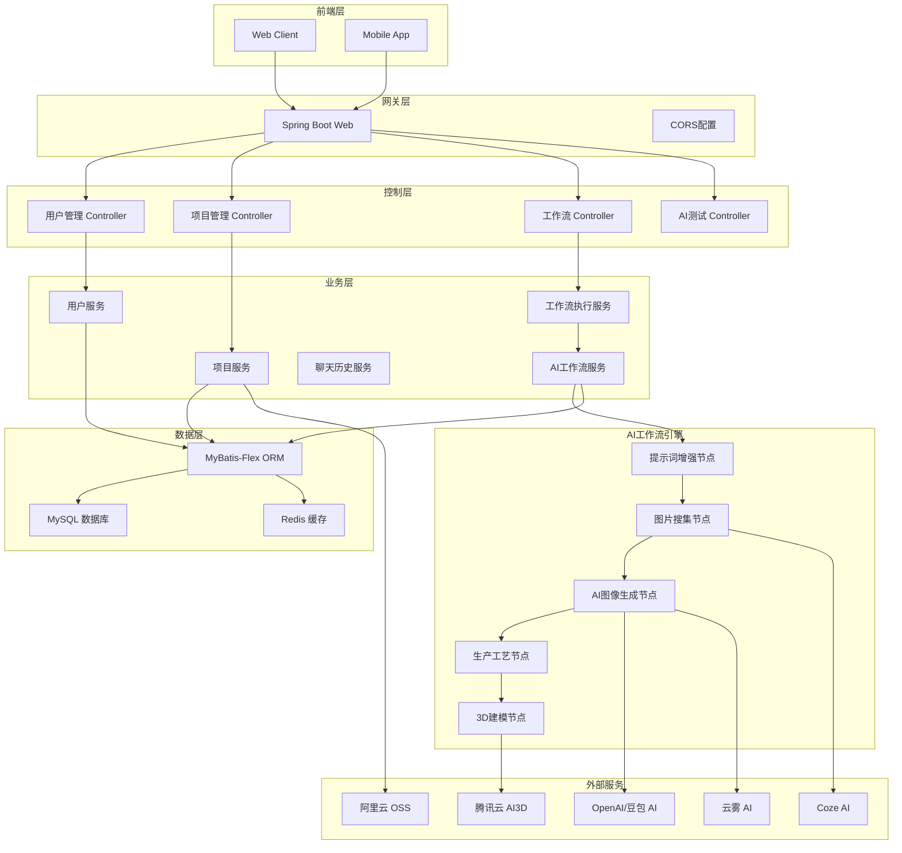
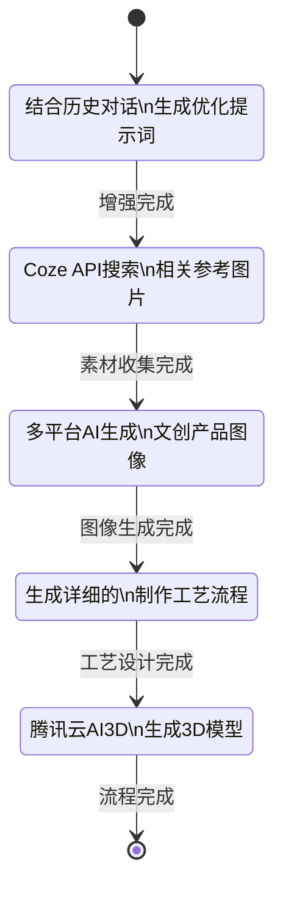

# SparkCraft BackEnd

<div align="center">
  <h2>🚀 AI驱动的文创产品设计与制作平台</h2>
  <p>基于 Spring Boot 3.5.5 构建的企业级后端服务</p>
  
  
  
  
  
</div>

## 📋 目录

- [项目概述](#项目概述)
- [核心特性](#核心特性)
- [技术架构](#技术架构)
- [快速开始](#快速开始)
- [API文档](#api文档)
- [开发指南](#开发指南)
- [部署说明](#部署说明)
- [贡献指南](#贡献指南)

## 🎯 项目概述

SparkCraftBackEnd 是一个专注于 **AI 驱动的文创产品设计与制作** 的企业级后端服务。该项目集成了多种 AI 模型（OpenAI、豆包、云雾AI等）、工作流引擎（LangGraph4j）和云服务（腾讯云、阿里云），为用户提供从创意灵感到产品实现的全链路智能化服务。

### 🎨 应用场景

- **AI 文创设计**：茶具、工艺品、纪念品等文创产品的智能化设计
- **智能对话系统**：支持上下文记忆的 AI 助手对话
- **图像生成与处理**：多平台 AI 图像生成和 3D 模型制作
- **工作流自动化**：可配置的多步骤业务流程自动化执行

## ✨ 核心特性

### 🤖 多模型 AI 集成
- 支持 OpenAI、豆包、Coze、云雾AI 等多种 AI 服务
- 智能提示词增强和上下文记忆管理
- 基于 Spring AI 和 LangChain4j 的统一AI框架

### ⚡ 流式响应处理
- 基于 SSE (Server-Sent Events) 的实时流式输出
- 工作流执行进度实时推送
- 异步非阻塞的响应机制

### 🔄 智能工作流引擎
- 使用 LangGraph4j 构建可视化状态机工作流
- 支持节点化编排和自定义业务逻辑
- 从提示词增强到3D建模的完整流程自动化

### 📱 RESTful API
- 完整的用户管理、项目管理、聊天历史等 API 接口
- 基于 OpenAPI 3.0 的接口文档（Knife4j）
- 统一的响应格式和异常处理

### ☁️ 多云服务支持
- 腾讯云 AI3D 服务集成
- 阿里云 OSS 文件存储
- Redis 分布式缓存和会话管理

### 🔐 安全认证体系
- 基于 AOP 的权限控制（@AuthCheck）
- Spring Session 会话管理
- 角色权限区分（user/admin）

## 🏗️ 技术架构

### 系统架构图



### 工作流架构



### 技术选型

| 分类 | 技术 | 版本 | 用途 |
|------|------|------|------|
| **后端框架** | Spring Boot | 3.5.5 | 主框架 |
| **Java版本** | JDK | 17 | 运行环境 |
| **ORM框架** | MyBatis-Flex | Latest | 数据库操作 |
| **数据库** | MySQL | 8.0+ | 数据存储 |
| **缓存** | Redis | 6.0+ | 缓存/Session |
| **AI框架** | Spring AI | Latest | OpenAI集成 |
| **AI框架** | LangChain4j | Latest | AI工作流 |
| **工作流** | LangGraph4j | RC2 | 状态机工作流 |
| **云服务** | 腾讯云SDK | Latest | AI3D服务 |
| **文件存储** | 阿里云OSS | Latest | 对象存储 |
| **API文档** | Knife4j | Latest | OpenAPI 3.0 |
| **工具库** | Hutool | Latest | 通用工具 |
| **构建工具** | Maven | 3.6+ | 依赖管理 |

## 🚀 快速开始

### 环境要求

- **JDK 17+**
- **Maven 3.6+**
- **MySQL 8.0+**
- **Redis 6.0+**

### 本地运行

1. **克隆项目**
   ```bash
   git clone https://github.com/your-repo/SparkCraftBackEnd.git
   cd SparkCraftBackEnd
   ```

2. **配置数据库**
   ```sql
   CREATE DATABASE sparkcraft_db CHARACTER SET utf8mb4 COLLATE utf8mb4_unicode_ci;
   ```

3. **修改配置文件**
   ```yaml
   # application-local.yml
   spring:
     datasource:
       url: jdbc:mysql://localhost:3306/sparkcraft_db
       username: your_username
       password: your_password
     data:
       redis:
         host: localhost
         port: 6379
   ```

4. **启动服务**
   ```bash
   mvn spring-boot:run
   ```

5. **访问应用**
   - 应用地址：`http://localhost:8080`
   - API文档：`http://localhost:8080/doc.html`

## 📚 API文档

### 用户管理接口

#### 1. 用户注册
```http
POST /user/register
Content-Type: application/json

{
  "userAccount": "testuser",
  "userPassword": "12345678",
  "checkPassword": "12345678",
  "userName": "测试用户"
}
```

#### 2. 用户登录
```http
POST /user/login
Content-Type: application/json

{
  "userAccount": "testuser",
  "userPassword": "12345678"
}
```

#### 3. 获取当前用户
```http
GET /user/get/login
```

### 项目管理接口

#### 1. 创建文创项目
```http
POST /imageProject/add
Content-Type: application/json

{
  "projectName": "陶瓷茶具设计",
  "projectDesc": "传统中式茶具的现代化设计",
  "projectImageUrl": "https://example.com/image.jpg"
}
```

#### 2. 获取项目列表
```http
POST /imageProject/list/page/vo
Content-Type: application/json

{
  "current": 1,
  "pageSize": 10,
  "sortField": "createTime",
  "sortOrder": "descend"
}
```

### AI对话接口

#### 1. AI灵感对话（SSE流式）
```http
GET /imageProject/chat/get/idea?message=设计一个现代简约的茶杯&projectId=1
```

**响应示例：**
```
data: {
  "type": "message",
  "content": "对于现代简约的茶杯设计，我建议...",
  "timestamp": "2024-01-01T10:00:00Z"
}

data: {
  "type": "end",
  "messageId": "msg_12345"
}
```

### 工作流执行接口

#### 1. 执行文创产品生成工作流
```http
POST /imageProject/workflow/execute
Content-Type: application/json

{
  "prompt": "设计一个现代简约的陶瓷茶杯",
  "projectId": 1,
  "userId": 1
}
```

**响应示例：**
```json
{
  "code": 0,
  "data": {
    "jobId": "job_abc123",
    "status": "RUNNING",
    "progress": 0
  },
  "message": "工作流已启动"
}
```

#### 2. 获取工作流进度（SSE流式）
```http
GET /workflow/progress/job_abc123
```

**进度事件示例：**
```
data: {
  "type": "progress",
  "jobId": "job_abc123",
  "progress": 20,
  "currentNode": "提示词增强",
  "message": "正在优化提示词..."
}

data: {
  "type": "nodeComplete",
  "jobId": "job_abc123",
  "progress": 40,
  "completedNode": "提示词增强",
  "result": {
    "enhancedPrompt": "优化后的提示词内容..."
  }
}

data: {
  "type": "complete",
  "jobId": "job_abc123",
  "progress": 100,
  "finalResult": {
    "imageUrl": "https://generated-image.jpg",
    "threeDModelUrl": "https://3d-model.obj",
    "productionProcess": "详细的生产工艺流程..."
  }
}
```

### AI服务测试接口

#### 1. Coze API测试
```http
GET /coze/test/connection
```

#### 2. 云雾AI测试
```http
GET /yunwu/test/generate
```

#### 3. 豆包AI测试
```http
GET /workflow/test/doubao-api-test
```

### 响应格式

所有API响应遵循统一格式：

```json
{
  "code": 0,          // 0-成功, 非0-失败
  "data": {},         // 返回数据
  "message": "success" // 提示信息
}
```

## 🛠️ 开发指南

### 项目结构

```
SparkCraftBackEnd/
├── src/
│   ├── main/
│   │   ├── java/com/lucius/sparkcraftbackend/
│   │   │   ├── ai/                    # AI相关功能
│   │   │   │   ├── config/               # AI配置
│   │   │   │   ├── handler/              # 流式处理
│   │   │   │   └── node/                 # 工作流节点
│   │   │   ├── controller/           # 控制层
│   │   │   ├── service/              # 业务层
│   │   │   ├── mapper/               # 数据访问层
│   │   │   ├── entity/               # 实体类
│   │   │   ├── dto/                  # 数据传输对象
│   │   │   ├── vo/                   # 视图对象
│   │   │   └── config/               # 系统配置
│   │   └── resources/
│   │       ├── mapper/               # MyBatis XML
│   │       ├── prompt/               # AI提示词模板
│   │       └── application.yml       # 配置文件
│   └── test/                      # 测试代码
├── pom.xml                      # Maven配置
└── README.md
```

### 开发规范

#### 代码风格
- 使用 **Lombok** 注解减少样板代码
- 遵循 **驼峰命名** 规范
- **DTO/VO** 分层清晰，避免数据泄露
- 使用 **@AuthCheck** 注解进行权限控制

#### 数据库设计
- 使用 **雪花算法** 生成主键 ID
- 主外键关系明确，保证数据一致性
- 数据库表名使用 **下划线** 命名

#### API设计
- 遵循 **RESTful** 设计原则
- 统一响应格式（BaseResponse）
- 错误处理统一化（GlobalExceptionHandler）

### 数据库初始化

1. **创建数据库**
   ```sql
   CREATE DATABASE sparkcraft_db CHARACTER SET utf8mb4 COLLATE utf8mb4_unicode_ci;
   ```

2. **执行初始化SQL**
   ```bash
   mysql -u root -p sparkcraft_db < src/main/resources/Sqls.sql
   ```

3. **核心表结构**
   - `user` - 用户信息表
   - `image_project` - 文创项目表
   - `chat_history` - 聊天历史表
   - `workflow_job` - 工作流任务表
   - `three_d_result` - 3D模型结果表

### 配置说明

#### 主配置文件 `application.yml`
```yaml
spring:
  application:
    name: SparkCraftBackEnd
  profiles:
    active: local
  session:
    store-type: redis
    timeout: 86400

server:
  port: 8080
  servlet:
    context-path: /api

mybatis-flex:
  mapper-locations: classpath*:/mapper/*.xml
  type-aliases-package: com.lucius.sparkcraftbackend.entity
```

#### 本地环境配置 `application-local.yml`
```yaml
spring:
  datasource:
    driver-class-name: com.mysql.cj.jdbc.Driver
    url: jdbc:mysql://localhost:3306/sparkcraft_db?useUnicode=true&characterEncoding=UTF-8&useSSL=false&serverTimezone=Asia/Shanghai
    username: ${DB_USERNAME:root}
    password: ${DB_PASSWORD:123456}
  data:
    redis:
      host: ${REDIS_HOST:localhost}
      port: ${REDIS_PORT:6379}
      password: ${REDIS_PASSWORD:}
      database: 0

# AI服务配置
ai:
  openai:
    api-key: ${OPENAI_API_KEY:}
    base-url: ${OPENAI_BASE_URL:https://api.openai.com}
  doubao:
    api-key: ${DOUBAO_API_KEY:}
    base-url: ${DOUBAO_BASE_URL:}

# 云服务配置
tencent:
  cloud:
    secret-id: ${TENCENT_SECRET_ID:}
    secret-key: ${TENCENT_SECRET_KEY:}

alicloud:
  oss:
    endpoint: ${ALICLOUD_OSS_ENDPOINT:}
    access-key-id: ${ALICLOUD_ACCESS_KEY_ID:}
    access-key-secret: ${ALICLOUD_ACCESS_KEY_SECRET:}
    bucket-name: ${ALICLOUD_OSS_BUCKET:}
```

### 本地开发流程

1. **环境准备**
   - 安装 JDK 17
   - 安装 Maven 3.6+
   - 启动 MySQL 和 Redis

2. **IDE配置**
   - 安装 Lombok 插件
   - 启用 Annotation Processing
   - 设置编码为 UTF-8

3. **运行项目**
   ```bash
   # 编译
   mvn clean compile
   
   # 运行测试
   mvn test
   
   # 启动服务
   mvn spring-boot:run
   ```

4. **测试验证**
   - 访问健康检查：`http://localhost:8080/health`
   - 查看API文档：`http://localhost:8080/doc.html`

## 🚀 部署说明

### Maven打包

```bash
# 清理并打包
mvn clean package -DskipTests

# 生成目标文件
# target/LangChainProject-0.0.1-SNAPSHOT.jar
```

### 传统部署

```bash
# 直接运行 JAR 文件
java -jar target/LangChainProject-0.0.1-SNAPSHOT.jar

# 指定环境变量
java -Dspring.profiles.active=prod -jar target/LangChainProject-0.0.1-SNAPSHOT.jar

# 后台运行
nohup java -jar target/LangChainProject-0.0.1-SNAPSHOT.jar > app.log 2>&1 &
```

### Docker部署

1. **创建 Dockerfile**
   ```dockerfile
   FROM openjdk:17-jre-slim
   
   WORKDIR /app
   
   COPY target/LangChainProject-0.0.1-SNAPSHOT.jar app.jar
   
   EXPOSE 8080
   
   ENTRYPOINT ["java", "-jar", "app.jar"]
   ```

2. **构建镜像**
   ```bash
   docker build -t sparkcraft-backend:latest .
   ```

3. **运行容器**
   ```bash
   docker run -d \
     --name sparkcraft-backend \
     -p 8080:8080 \
     -e SPRING_PROFILES_ACTIVE=prod \
     -e DB_HOST=your_db_host \
     -e REDIS_HOST=your_redis_host \
     sparkcraft-backend:latest
   ```

### Docker Compose部署

```yaml
# docker-compose.yml
version: '3.8'

services:
  app:
    build: .
    ports:
      - "8080:8080"
    environment:
      - SPRING_PROFILES_ACTIVE=prod
      - DB_HOST=mysql
      - REDIS_HOST=redis
    depends_on:
      - mysql
      - redis
      
  mysql:
    image: mysql:8.0
    environment:
      MYSQL_ROOT_PASSWORD: root123
      MYSQL_DATABASE: sparkcraft_db
    ports:
      - "3306:3306"
    volumes:
      - mysql_data:/var/lib/mysql
      
  redis:
    image: redis:6.2
    ports:
      - "6379:6379"
    volumes:
      - redis_data:/data

volumes:
  mysql_data:
  redis_data:
```

**启动服务：**
```bash
docker-compose up -d
```

### 生产环境注意事项

1. **安全配置**
   - 使用 HTTPS 协议
   - 配置防火墙和安全组
   - 定期更新依赖库

2. **监控和日志**
   - 集成 Spring Boot Actuator
   - 配置日志收集（ELK Stack）
   - 设置应用性能监控

3. **数据备份**
   - 定期备份 MySQL 数据
   - Redis 数据持久化配置

## 🤝 贡献指南

欢迎所有开发者为 SparkCraftBackEnd 项目贡献代码！

### 贡献流程

1. **Fork 项目**
   点击页面右上角的 "Fork" 按钮

2. **克隆代码**
   ```bash
   git clone https://github.com/YOUR_USERNAME/SparkCraftBackEnd.git
   cd SparkCraftBackEnd
   ```

3. **创建分支**
   ```bash
   git checkout -b feature/your-feature-name
   ```

4. **开发功能**
   - 遵循项目代码规范
   - 添加必要的测试用例
   - 更新相关文档

5. **提交代码**
   ```bash
   git add .
   git commit -m "feat: add your feature description"
   git push origin feature/your-feature-name
   ```

6. **创建 Pull Request**
   在 GitHub 上创建 PR，详细描述您的修改

### Commit 信息规范

使用 [Conventional Commits](https://www.conventionalcommits.org/) 规范：

- `feat:` 新功能
- `fix:` 修复 bug
- `docs:` 文档更新
- `style:` 代码格式调整
- `refactor:` 代码重构
- `test:` 添加或修改测试
- `chore:` 构建过程或辅助工具的变动

### 问题反馈

如果您遇到问题或有改进建议，请在 [Issues](https://github.com/your-repo/SparkCraftBackEnd/issues) 页面提交。

---

<div align="center">
  <p>如果这个项目对您有帮助，请给我们一个 ⭐ Star！</p>
  <p>© 2025 SparkCraftBackEnd. All rights reserved.</p>
</div>
